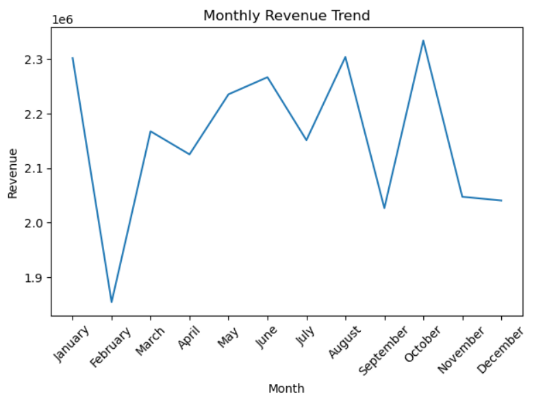

# 📊 Revenue & Sales Analytics

## Executive Summary
- This project analyses transactional sales data t o uncover meaningful insights
related to revenue trends, customer behaviour, regional performance, and
payment preferences.
The analysis involved data cleaning, feature engineering, and exploratory data
analysis (EDA) using Python. Key findings include sea sonal revenue
fluctuations, strong regional performance in the West, digital payment
dominance, and opportunities to increase Average Order Value (AOV) through
strategic initiatives.
The objective of this project was not only to analyse data but also to translate
insights in to actionable business recommendation
---

## 🎯 Project Objectives
- Analyze monthly revenue trends
- Identify seasonal sales patterns
- Examine regional revenue distribution
- Understand customer payment preferences
- Provide business recommendations based on insights

---

## 🛠️ Tools & Technologies
- Python
- Pandas
- Matplotlib
- Jupyter Notebook

---

## 🧹 Data Cleaning & Preparation
- Handled missing values using appropriate techniques
- Converted transaction dates to datetime format
- Standardized payment method values
- Corrected inconsistent data types
- Ensured dataset accuracy before analysis

---

## 📊 Exploratory Data Analysis (EDA)

### 1️⃣ Monthly Revenue Trend
- Calculated total revenue per month
- Identified seasonal fluctuations
- Visualized revenue patterns using line charts

---

### 2️⃣ Regional Revenue Distribution
- Analyzed revenue contribution by region
- Identified the highest-performing region

---

### 3️⃣ Payment Method Analysis
- Examined customer preference for digital vs cash payments
- Identified dominant transaction methods

---

## 🔍 Key Insights
- Revenue shows growth in specific months, indicating seasonal demand.
- Certain months experience lower performance, suggesting scope for targeted promotions.
- The West region contributes the highest share of total revenue.
- Digital payment methods dominate customer transactions.
- Most orders fall within lower-value ranges, presenting opportunities to increase Average Order Value (AOV).

---

## 💡 Business Recommendations
- Introduce marketing campaigns during low-performing months.
- Expand promotional strategies in underperforming regions.
- Implement upselling and bundling strategies to increase AOV.
- Maintain a secure and seamless digital payment infrastructure.

---

